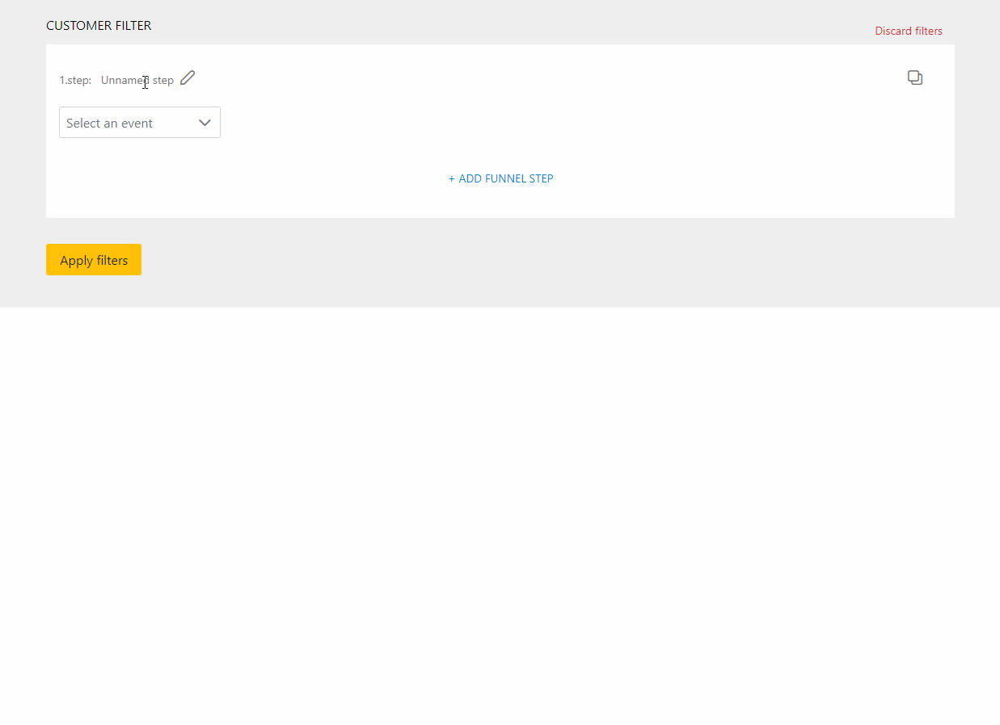

# Angular Projects

## ## Quick Overview
- **#1 Employee Manager**: **[[ live demo ](https://ashy-grass-05653e71e-preview.westus2.5.azurestaticapps.net/)]**   ·   **[[ Angular and .NET Core code ](https://github.com/gorj00/Angular---.NET-Core-8-API---EmployeeManager)]**,
- **#2 Customer filter template**: **[[ live demo ](https://gorj00.github.io/demos/customer-filter/)]**   ·   **[[ Angular code ](https://github.com/gorj00/Angular-Customer-Filter)]**,
- **#3 USD Converter**: **[[ live demo ](https://gorj00.github.io/demos/usd-converter/)]**   ·   **[[ Angular code ](https://github.com/gorj00/Angular-USDconverter)]**,
- **#4 Movie Quiz**: **[[ live demo ](https://gorj00.github.io/demos/movie-quiz/)]**   ·   **[[ Angular code ](./Angular-MovieQuiz)]**,

See more information about each project below.

## #1 Employee Manager
**[[ LIVE DEMO ](https://ashy-grass-05653e71e-preview.westus2.5.azurestaticapps.net/)]**   ·   **[[ ANGULAR and .NET CORE CODE ](https://github.com/gorj00/Angular---.NET-Core-8-API---EmployeeManager)]**

- **keywords:** 
  - Deployed on Azure
  - REST API with .NET Core + MS SQL database backend (inside project as well)
  - Dependency injection
  - RxJS
  - Reactive forms
  - Angular 17 standalone components
  - PrimeNG UI components library

## #2 Customer Filter Template
**[[ LIVE DEMO ](https://gorj00.github.io/demos/customer-filter/)]**   ·   **[[ ANGULAR CODE ](https://github.com/gorj00/Angular-Customer-Filter)]**

- **keywords:** 
  - composing of customer-related stats filters, the result is sorted and logged into the console,
  - Reactive forms – FormBuilder, FormGroup, FormControl, FormArray,
  - NgPrime UI library

- **usage demo:**

## #3 USD Converter (ENG and CZE) 
**[[ LIVE DEMO ](https://gorj00.github.io/demos/usd-converter/)]**   ·   **[[ ANGULAR CODE ](https://github.com/gorj00/Angular-USDconverter)]**

- **keywords:** 
  - Dependency injection
  - RxJS
  - Forms — Template driven approach
  - HttpClient
  - Angular Material 
  - Exchange rates API
  - ngx-translate — switching between English and Czech

## #4 Movie Quiz
**[[ LIVE DEMO ](https://gorj00.github.io/demos/movie-quiz/)]**   ·   **[[ ANGULAR CODE ](./Angular-MovieQuiz)]**

- **keywords:** 
  - external API ([The Movie DB](https://www.themoviedb.org/))
  - HttpClient
  - Observables, Reactive Programming (RxJS)
  - Dependency Injection
  - Components parent/child communication (Input, Output)
  - Angular Material
